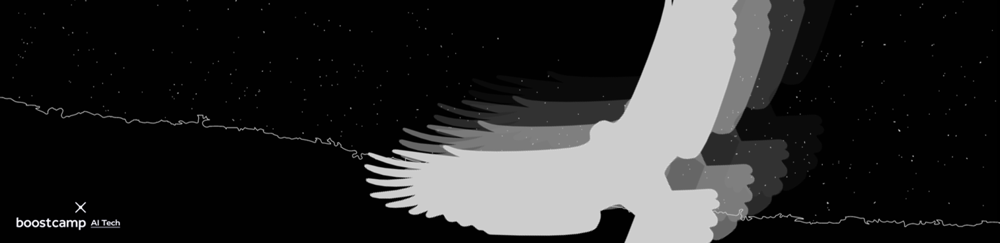

<div align="center"> 
    
</div>

## 👉 [Discussions](https://github.com/bcaitech1/p3-ims-obd-eagle-eye/discussions)

피어세션 기록 및 질문은 Discussions에 저장합니다!

---

## 📝 Table of Contents

- [폴더 구조](#-폴더-구조)
- [팀원 소개](#-팀원-소개)

---

## 📁 폴더 구조

```
├── baseline        # 베이스라인 코드
├── code            # 학습 python 파일
└── experiment      # 팀원별 실험코드
    ├── arm         
    ├── bsoomin    
    ├── jaehyuk    
    ├── jiyoung     
    ├── jsj
    └── sohyun
```

---

## 👋 팀원 소개

|                                                                                      박소현                                                                                      |                                                             배수민                                                             |                                                          이아름                                                           |                                                            정지영                                                            |                                                            조성진                                                             |                                                            최재혁                                                             |
| :------------------------------------------------------------------------------------------------------------------------------------------------------------------------------: | :----------------------------------------------------------------------------------------------------------------------------: | :-----------------------------------------------------------------------------------------------------------------------: | :--------------------------------------------------------------------------------------------------------------------------: | :---------------------------------------------------------------------------------------------------------------------------: | :---------------------------------------------------------------------------------------------------------------------------: |
| <a href='https://github.com/CoodingPenguin'></a> | <a href='https://github.com/bsm8734'></a> | <a href='https://github.com/areum514'></a> | <a href='https://github.com/bitwarrior1'></a> | <a href='https://github.com/Jo-ad-fontes'></a> | <a href='https://github.com/opijae'></a> |
